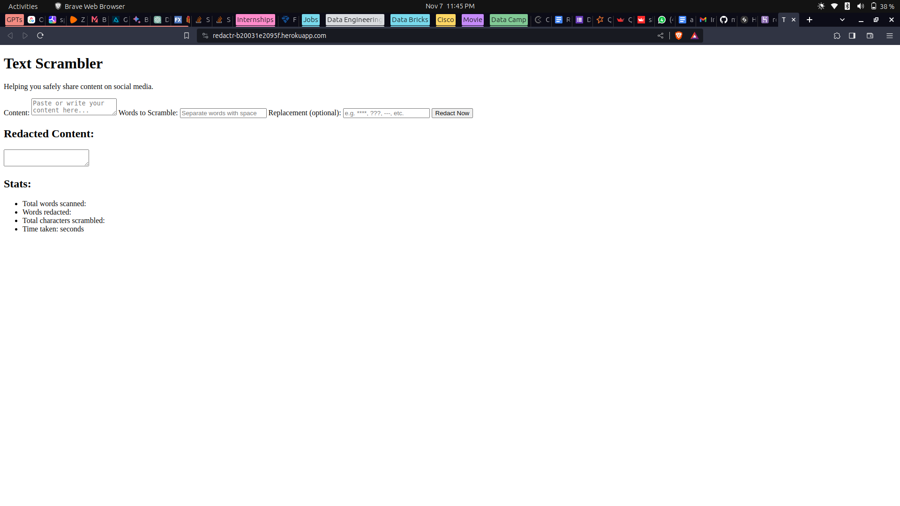
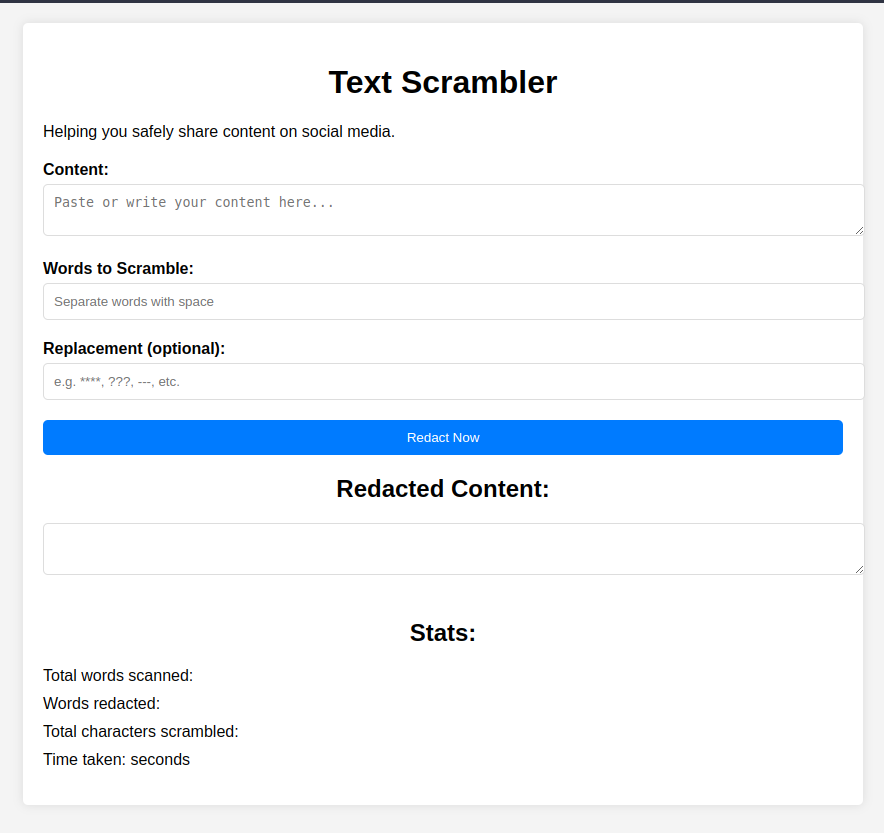
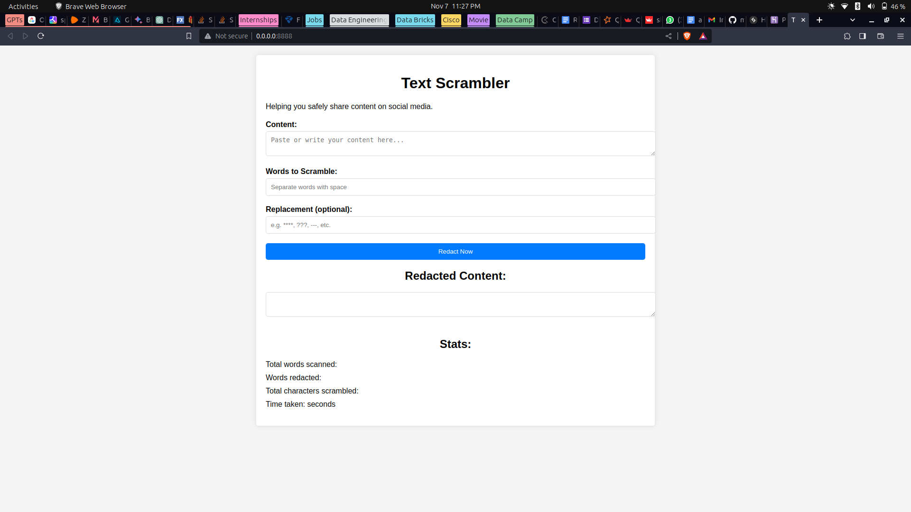

---

# FastAPI Text Redaction App: A Devcareer project

This FastAPI application provides a web interface for text redaction, allowing users to replace specified words within a text with a replacement string.

## Features

- Serve HTML content using Jinja2 templates.
- Accept text submissions and perform redaction based on user input.
- Static files (e.g., CSS, html) served from a designated directory.

## Endpoints

### `GET /`

Renders the main page where users can input text for redaction.

#### Response

- `HTMLResponse`: The HTML content of the index page.

### `POST /redact`

Accepts form data containing text to redact and the words to be replaced, then returns the redacted text.

#### Parameters

- `content` (str): The text content to be scanned for redaction.
- `words` (str): Space-separated words to be redacted.
- `replacement` (str, optional): The string to replace the redacted words with. Defaults to "****".

#### Response

- `HTMLResponse`: The HTML content of the index page, updated with redaction results.

## Static Files

The application serves static files (like CSS) from the `/static` directory, which is set relative to the project's root directory.

## Templates

HTML templates are stored in the `/templates` directory and are used to render the web pages with context.

## Usage

- after cloning the repo, run;
  
```python
    python3 -m pip install -r requirements.txt
```
This will install all dependencies needed to run this project locally.
Ensure to run this on a python virtual environment.


Ensure that the `logic` module is present and contains the `scan_stats` function, which performs the actual redaction logic.

---

## Local Development

Uncomment the lines at the bottom of the file to enable running the application locally using Uvicorn.

```python
# if __name__ == "__main__":
#     uvicorn.run(app, host="0.0.0.0", port=8888)
```

- To run the application locally:
On the root directory, open your terminal and type

```python
python3 scripts/backend.py
```

## Notes

- The `static` directory is configured using `pathlib` to ensure correct path resolution regardless of the operating system.
- This application should be configured with a reverse proxy like Nginx when deployed to production for serving static files efficiently and securely.

- Unfortunately, when this app was deployed on Heroku, the css styling wasn't displayed as it should. Reasons being that Heroku failed to read to the static file correctly. For future refereces and research, this app will be likely redeployed on another platform.
  
---

## App preview on Heroku



## Heroku live link
[Redactr](https://redactr-b20031e2095f.herokuapp.com/)


## APP PREVIEW
This is what your app should look like when ran properly locally.



## Full desktop view
